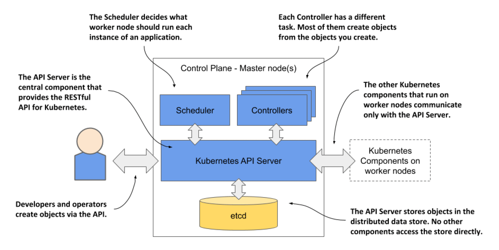

# What is Kubernetes
Kubernetes is an open source container orchestration engine for automating deployment, scaling, and management of containerized applications. The open source project is hosted by the Cloud Native Computing Foundation (CNCF).

It schedules, runs and mananges isloated containers which are running on virtual | physical | cloud machnies.

## History

* The word Kubernetes is Greek for pilot or helmsman, the person who steers the ship.
* Google developed an internal system called 'Borg' (later named as 'Omega') to deply and manage thousands Google applications 
 and services on this cluster.
* In 2014, Google introduced Kubernetes an open source platform written in Golang and later denoated to CNCF.

## Online platforms for K8s

* Kunernetes playground
* Play with K8s
* Play with Kubernetes classroom

## Managed Kubernetes Cluster in the Cloud
_The top managed Kubernetes offerings include the following:_

* Google Kubernetes Engine (GKE)
* Azure Kubernetes Service (AKS)
* Amazon Elastic Kubernetes Service (EKS)
* IBM Cloud Kubernetes Service
* Red Hat OpenShift Online and Dedicated
* VMware Cloud PKS
* Alibaba Cloud Container Service for Kubernetes (ACK)

## Problems with Scaling up the Containers

* Containers cannot communicate with each other
* Autoscaling and laod balancing was not possible
* Contianers had to be managed carefully

## Feature of Kubernetes

_Here are the essential Kubernetes features:_

* Orchestration (cluster of any number of container running on different network)
* Automated Scheduling
* Self-Healing Capabilities
* Automated rollouts & rollback
* Horizontal Scaling 
* Load Balancing
* Fault tolerance (Node | Pod failure)
* Health monitoring of containers
* Offers enterprise-ready features
* Application-centric management
* Auto-scalable infrastructure
* Service Discovery
* Platform independent (cloud | virtual | physical)
* Secret and Configuration Management
* Offers environment consistency for development, testing, and production
* Infrastructure is loosely coupled to each component can act as a separate unit

## Kubernetes vs Docker Swarm

|Features | Kubernetes | Docker Swarm |
------------- | ------------- | ------------ | 
| Installation and Cluster configuration | Complicated and Time consuming | Fast and easy |
| Supports | Works with all container types - Rocket, Docker, ContainerD | Works with Docker only | 
| GUI | Available | No GUI |
| Data Volumes | Only shared with containers win same Pod | Can be shared with any other Container |
| Updates and Rollbacks | Process scheduling to maintain services while updating | Progressive updates of servies health monitoring throught the update|
| Autoscaling | Vertical and Horizontal | No support|
| Logging and Monitoring | Inbuitl tool present |  Use third party like Splunk

## Kubernetes Architecture

A Kubernetes cluster consists of a set of worker machines, called nodes, that run containerized applications. Every cluster has at least one worker node.

The worker node(s) host the Pods that are the components of the application workload. The control plane manages the worker nodes and the Pods in the cluster. 

### Control Plane Components

The Kubernetes control plane manages clusters and resources such as worker nodes and pods. The control plane receives information such as cluster activity, internal and external requests. 

It ensures that every component in the cluster is kept in the desired state. It receives data about internal cluster events, external systems, and third-party applications, then processes the data and makes and executes decisions in response.

The control plane manages and maintains the worker nodes that hold the containerized applications. The control plane not only exposes the layer that deploys the containers, but also manages their lifecycle. 

There are several key parts to the control plane:

* kube-apiserver - An API server that transmits data both within the cluster and with external services
* kube-scheduler - A scheduler that handles resource sharing among the nodes
* kube-controller-manager - A controller manager that watches the state of the nodes
* etcd - A persistent data store to keep configurations
* cloud-controller-manager - A controller manager and a cloud controller manager to manage control loops

1. **kube-apiserver**

* Central hub of the Kubernetes cluster that exposes the Kubernetes API
* Only way to interact with a running Kubernetes cluster
* Can issue commands to the API server using the Kubectl CLI or an HTTP client
* As front end of the Kubernetes API, it serves as the access point for client requests
* Designed to scale horizontally — scales by deploying more instances
* The communication between the API server and other components in the cluster happens over TLS to prevent unauthorized access to the cluster
* API management: Exposes the cluster API endpoint and handles all API requests.
* Authentication (Using client certificates, bearer tokens, and HTTP Basic Authentication) and Authorization (ABAC and RBAC and
 evaluation)
* Processing API requests and validating data for the API objects like pods, services, etc. (Validation and Mutation Admission controllers)
* It is the only component that communicates with etcd
* Coordinates all the processes between the control plane and worker node components

2. **kube-scheduler**

* Watches newly created Pods with no assigned node, and selects a node for them to run on.
* 
Factors taken into account for scheduling decisions include: individual and collective resource requirements, hardware/software/policy constraints, affinity and anti-affinity specifications, data locality, inter-workload interference, and deadlines.

Control plane component that runs controller processes.

Logically, each controller is a separate process, but to reduce complexity, they are all compiled into a single binary and run in a single process.

There are many different types of controllers. Some examples of them are:

Node controller: Responsible for noticing and responding when nodes go down.
Job controller: Watches for Job objects that represent one-off tasks, then creates Pods to run those tasks to completion.
EndpointSlice controller: Populates EndpointSlice objects (to provide a link between Services and Pods).
ServiceAccount controller: Create default ServiceAccounts for new namespaces.

## How Kubernetes runs an application

_These actions take place when you deploy the application:_
1. You submit the application manifest to the Kubernetes API. The API Server writes the objects defined in the manifest to etcd.
2. A controller notices the newly created objects and creates several new objects - one for each application instance.
3. The Scheduler assigns a node to each instance.
4. The Kubelet notices that an instance is assigned to the Kubelet’s node. It runs the application instance via the Container   
  Runtime.
5. The Kube Proxy notices that the application instances are ready to accept connections from clients and configures a load balancer for them.
6. The Kubelets and the Controllers monitor the system and keep the applications running.

## Deploying a Kubernetes cluster

### Kubernetes running in Docker Desktop

### Running a single-node Kubernetes cluster using Minikube

### Running a multi-node Kubernetes cluster using kind

#### Master Node