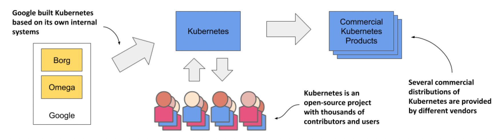

# What is Kubernetes
Kubernetes is an open source container orchestration engine for automating deployment, scaling, and management of containerized applications. The open source project is hosted by the Cloud Native Computing Foundation (CNCF).

It schedules, runs and mananges isloated containers which are running on virtual | physical | cloud machnies.

## History


* The word Kubernetes is Greek for pilot or helmsman, the person who steers the ship.
* Google developed an internal system called 'Borg' (later named as 'Omega') to deply and manage thousands Google applications 
 and services on this cluster.
* In 2014, Google introduced Kubernetes an open source platform written in Golang and later denoated to CNCF.

## Online platforms for K8s
* Play with K8s
* Kunernetes playground
* Play with Kubernetes classroom


## Example of Labels
```
kind: Pod
apiVersion: v1
metadata:
  name: labelpod
  labels:                                                   
    env: development
    class: pods
spec:
    containers:
      - name: container01 
        image: ubuntu
        command: ["/bin/bash", "-c", "while true; do echo Welcome to Lable Pod in container 01; sleep 5 ; done"]
```